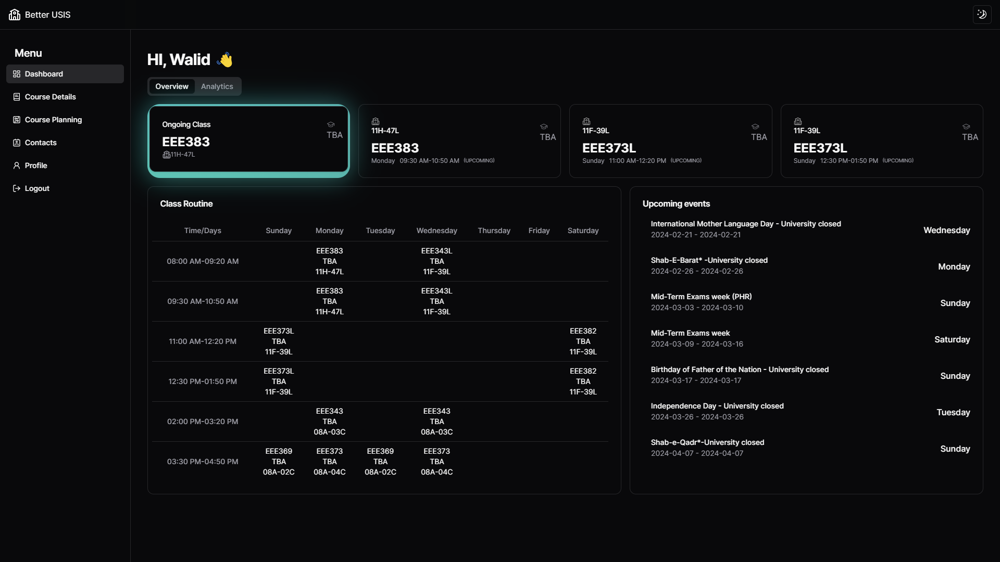
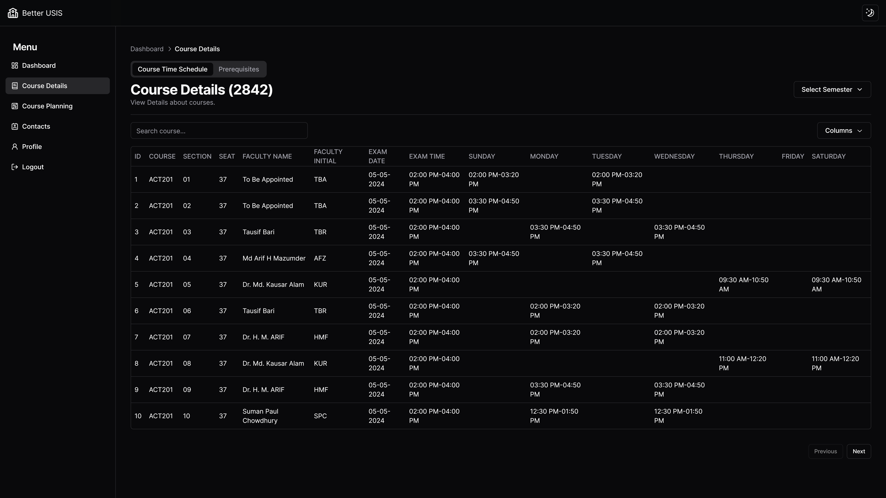
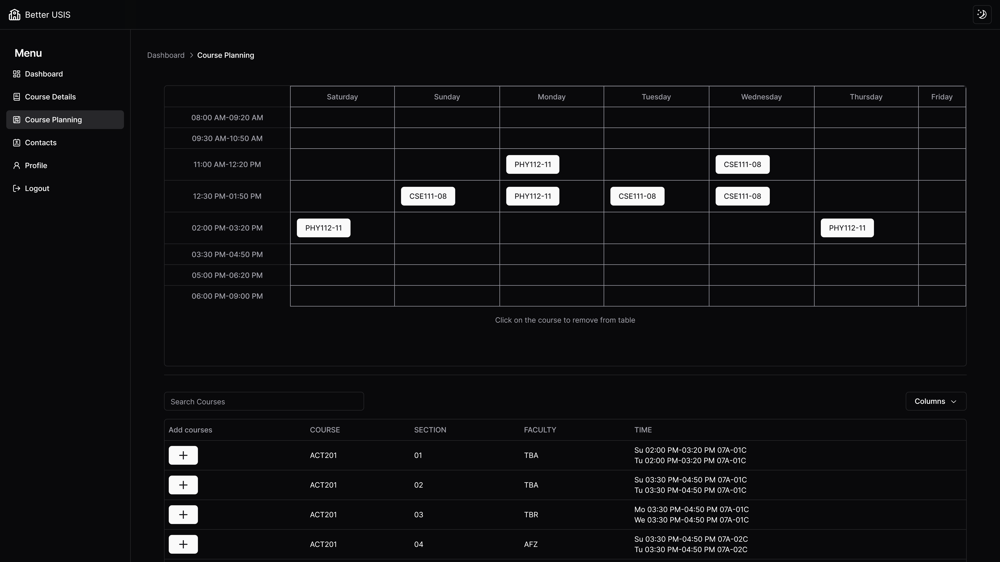

# Better USIS
Modern Interface and functionality for BRAC University's Student Information System.

Built with,

    
    
    
        

Some of the views,
<table border="1">
  <tr>
    <th>Overview</th>
    <th>Course Details</th>
    <th>Advising Planner</th>
  </tr>
  <tr>
    <td></td>
    <td></td>
    <td></td>
  </tr>
</table>
any many more.

*This project is a work in progress.*

### Disclaimer
This project is not affiliated with BRAC University. It is a personal project, that I'm doing to give back to my university and my juniors. Please Read the [Terms of Service](TOS.md)